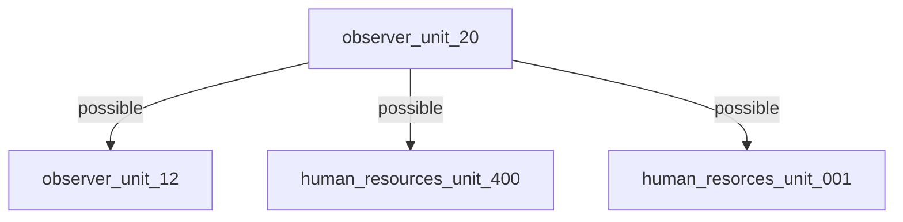

# ARRS-s5

## Users
| Username | Password | Name | Unlock time |
|----------|----------|------|-------------|
| [observer_unit_20](./Users/observer_unit_20.md) | 0fcf50356 | - | Start of the event |

## Possible users without passwords
- observer_unit_12
    - from the file [intercepted_data_0093.txt](https://github.com/3ncy/ARRS-s5/blob/main/Users/observer_unit_20.md#file-intercepted_data_0093txt) in [observer_unit_20](https://github.com/3ncy/ARRS-s5/blob/main/Users/observer_unit_20.md)
- human_resources_unit_400
    - from the file [intercepted_data_0092.txt](https://github.com/3ncy/ARRS-s5/blob/main/Users/observer_unit_20.md#file-intercepted_data_0092txt) in [observer_unit_20](https://github.com/3ncy/ARRS-s5/blob/main/Users/observer_unit_20.md)
- human_resorces_unit_001
    - from the file [intercepted_data_0091.txt](https://github.com/3ncy/ARRS-s5/blob/main/Users/observer_unit_20.md#file-intercepted_data_0091txt) in [observer_unit_20](https://github.com/3ncy/ARRS-s5/blob/main/Users/observer_unit_20.md)
  
## Possible passwords without known username
