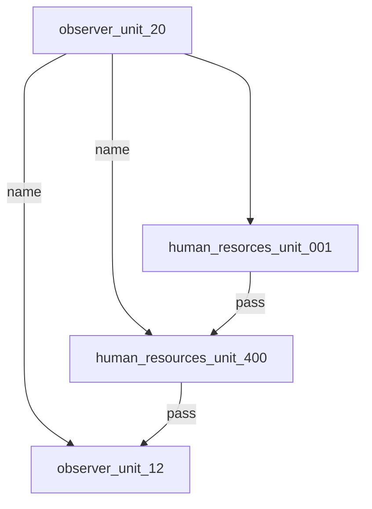

# ARRS-s5

## Users
| Username | Password | Name | Unlock time | Status |
|----------|----------|------|-------------|--------|
| [observer_unit_20](./Users/observer_unit_20.md) | 0fcf50356 | - | Start of the event | Solved |
| [human_resources_unit_001](./Users/human_resources_unit_001.md) | 5e065d5d04263346d7ea2cb28ca225a8 | - | some time before 18:20 GMT+1 | Solved |
| [human_resources_unit_400](./Users/human_resources_unit_400.md) | dc075e5a3d85be49b5035bbe7faebe89 | - | 18:30 GMT+1 | Solved |
| [observer_unit_12](./Users/observer_unit_12.md) | 2ab9929642539a8c6c7de73448861fb8 | - | 19:30 GMT+1 | In Progress |
| [Supplymanager_unit092](./Users/Supplymanager_unit092.md) | VjFaV2IxVXdNVWhVYTJ4VlZrWndU | - | 15:00 GMT+1, 03.12. |

## Possible users without passwords
-
  
## Possible passwords without known username
-
