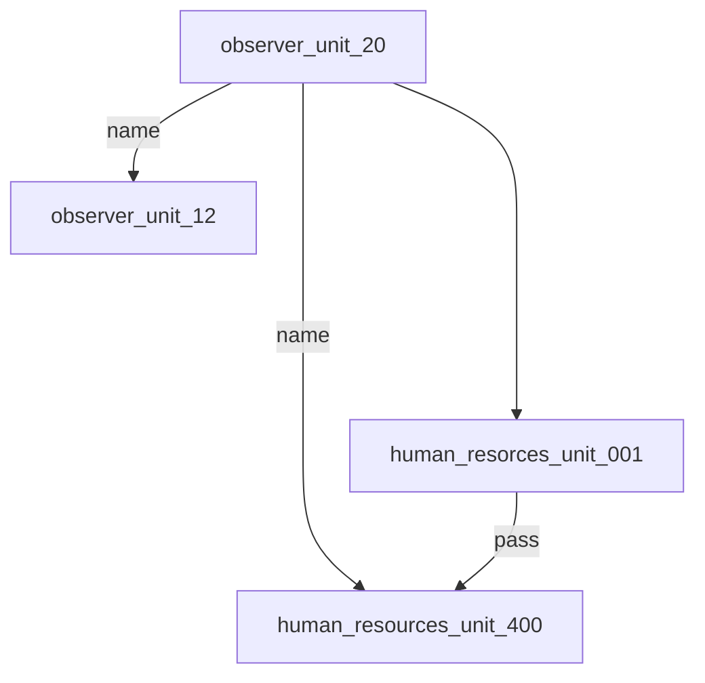

# ARRS-s5

## Users
| Username | Password | Name | Unlock time |
|----------|----------|------|-------------|
| [observer_unit_20](./Users/observer_unit_20.md) | 0fcf50356 | - | Start of the event |
| [human_resources_unit_001](./Users/human_resources_unit_001.md) | 5e065d5d04263346d7ea2cb28ca225a8 | - | some time before 18:20 GMT+1 |
| [human_resources_unit_400](./Users/human_resources_unit_400.md) | dc075e5a3d85be49b5035bbe7faebe89 | - | 18:30 GMT+1 |

## Possible users without passwords
- observer_unit_12
    - from the file [intercepted_data_0093.txt](https://github.com/3ncy/ARRS-s5/blob/main/Users/observer_unit_20.md#file-intercepted_data_0093txt) in [observer_unit_20](https://github.com/3ncy/ARRS-s5/blob/main/Users/observer_unit_20.md)
  
## Possible passwords without known username
