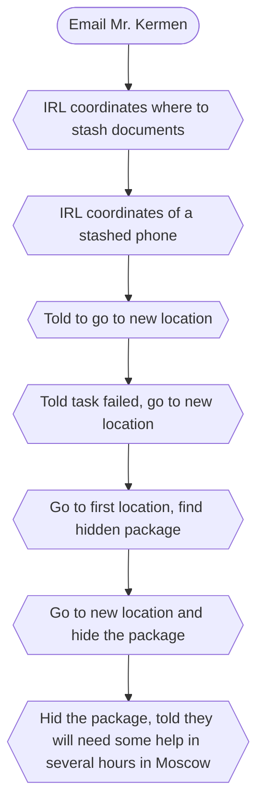

# ARRS-s5-irl2-tracker

## Kermen email
Thank you for your interest. The work is project-based, involving four locations (co compensation for tickets or lodging). I will briefly outline your obligations. You will be required to visit four locations. USA: 39°07'04.4''N 84°29'12.3''W, Japon:35.686950, 139.707061, Europe:51.548788, 7.302324, Russia: 59.932583, 30.327629 At each location, you must leave a package of documents on the development of the SJ1 TGLabs stimulant (You'll be able to pick a place to stash the documents within the selected coordinates). Documents quality requirements: an untrained employee may confuse the documents with real data. Use the template attached to this email. Mandatory condition: take a photo or video of the documents left in the correct place (the surroundings must be in the frame). Send the proof of completed work together with the documents in digital form to this emial. Execute as quickly as possible. Please note that one set of documents in each location will be sufficient. Kermen's representative

## Russian branch
Sent email -> got new coordinates -> put documents in automated deposit box -> another opened and got a phone with telegram -> Agent "K" (Kermen?) -> Told to go to new location to meet someone -> Got message, task failed, go to new location -> Arrived at the new location, took a photo, waited and got coordinates of the place where they stashed the documents, instructions to be given once there -> found a package -> told to go to new location and hide the package -> told they will need help in Moscow in several hours

### Russia part 2
Got new coords in Moscow on the phone that we found in the first part
Got to the coords and found a small package stashed in a hole (1x1x5cm) (a USB flash drive)

## EU Branch
Sent email -> got new coords -> found a phone, got new location -> took picture, was told picture is ok, waiting for further instructions

## NA Branch
Sent email -> got new coords ->

## Japan Branch
Sent email -> got new coords, show yourself on live webcam with something USEC related -> found USB flash drive
